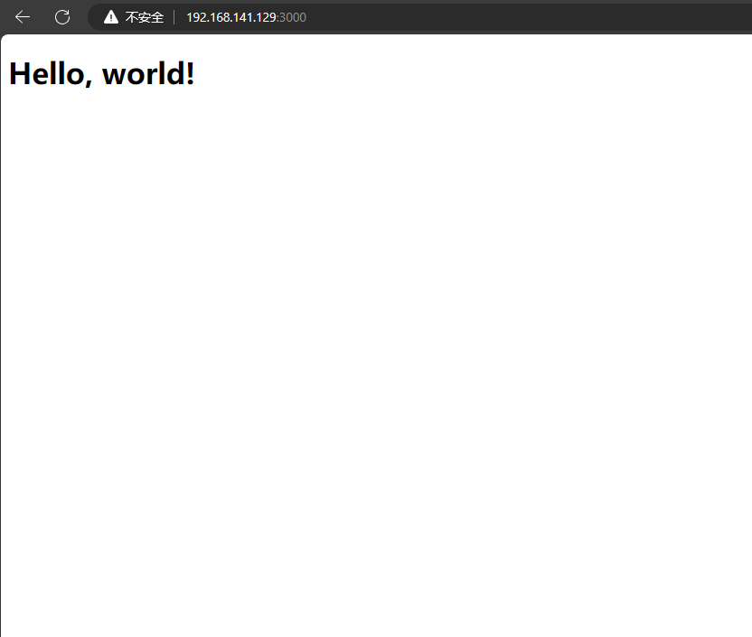

# 安装说明
## 安装docker
```
sed -i 's@SELINUX=enforcing@SELINUX=disabled@g' /etc/selinux/config
setenforce 0

swapoff -a
sed -i 's/\(^[^#]*\) swap/#\1 swap/' /etc/fstab

cat > /etc/sysctl.d/k8s.conf << EOF
net.bridge.bridge-nf-call-ip6tables = 1
net.bridge.bridge-nf-call-iptables = 1
net.ipv4.ip_forward = 1
vm.swappiness = 0
EOF
sysctl -p

systemctl stop firewalld
systemctl disable firewalld

systemctl disable docker && systemctl stop docker
yum -y remove docker.x86_64
rm -rf /var/lib/docker
rm -rf /etc/docker
rm -rf /usr/bin/docker

yum install -y yum-utils device-mapper-persistent-data lvm2 expect
yum-config-manager --add-repo https://mirrors.tuna.tsinghua.edu.cn/docker-ce/linux/centos/docker-ce.repo


yum install -y docker-ce-18.09.6 docker-ce-cli-18.09.6 containerd.io sshpass
systemctl enable docker && systemctl start docker
useradd rancher
usermod -aG docker rancher
echo 'de4a5a..' | passwd rancher --stdin
systemctl restart docker
sed -i "s/#AllowTcpForwarding yes/AllowTcpForwarding yes/g" /etc/ssh/sshd_config
```
## 配置免密
```
su rancher <<EOF
ssh-keygen -t rsa -P '' -f ~/.ssh/id_rsa &> /dev/null
ssh-keyscan -H 192.168.141.128 >> ~/.ssh/known_hosts
ssh-keyscan -H 192.168.141.129 >> ~/.ssh/known_hosts
sshpass -p 'de4a5a..' ssh-copy-id rancher@192.168.141.128
sshpass -p 'de4a5a..' ssh-copy-id rancher@192.168.141.129
EOF
```
## 编写rke配置
```
cat >> /home/rancher/cluster.yml<<-EOF
nodes:
  - address: 192.168.141.128
    user: rancher
    role:
      - controlplane
      - etcd
      - worker
    hostname_override: master-128
    ssh_key_path: /home/rancher/.ssh/id_rsa
  - address: 192.168.141.129
    user: rancher
    role:
      - worker
    hostname_override: node-129
    ssh_key_path: /home/rancher/.ssh/id_rsa
cluster_name: k8s
ingress:
  provider: nginx
  options:
    use-forwarded-headers: "true"
EOF
chown rancher:rancher /home/rancher/cluster.yml
```
## 下载rke 和 kubectl
```
wget https://github.com/rancher/rke/releases/download/v1.5.1/rke_linux-amd64
wget https://storage.googleapis.com/kubernetes-release/release/v1.19.6/bin/linux/amd64/kubectl
mv rke_linux-amd64 /usr/bin/rke
chmod a+x /usr/bin/rke
mv kubectl /usr/bin/
chmod a+x /usr/bin/kubectl
```
## 使用rancher用户启动rke安装k8s
```
su - rancher -c "rke up"
mkdir /root/.kube -p
mv /home/rancher/kube_config_cluster.yml /root/.kube/config
kubectl get no
```
## 构建docker镜像
```
docker build -t nodeweb:1.0 .
docker tag nodeweb:1.0 195350159/nodeweb:1.0
docker push 195350159/nodeweb:1.0
```
## 创建k8s文件并启动项目
```
kubectl apply -f ns.yml
kubectl apply -f deploy.yml
kubectl apply -f svc.yml
```
## 运行结果

